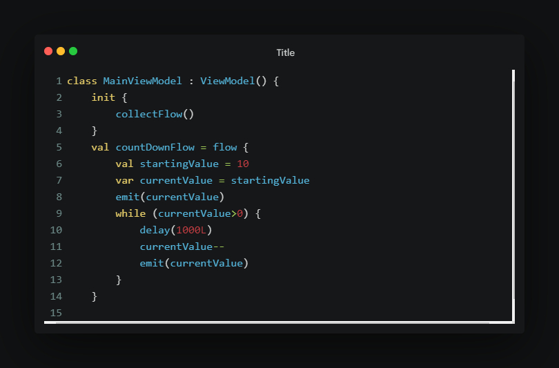
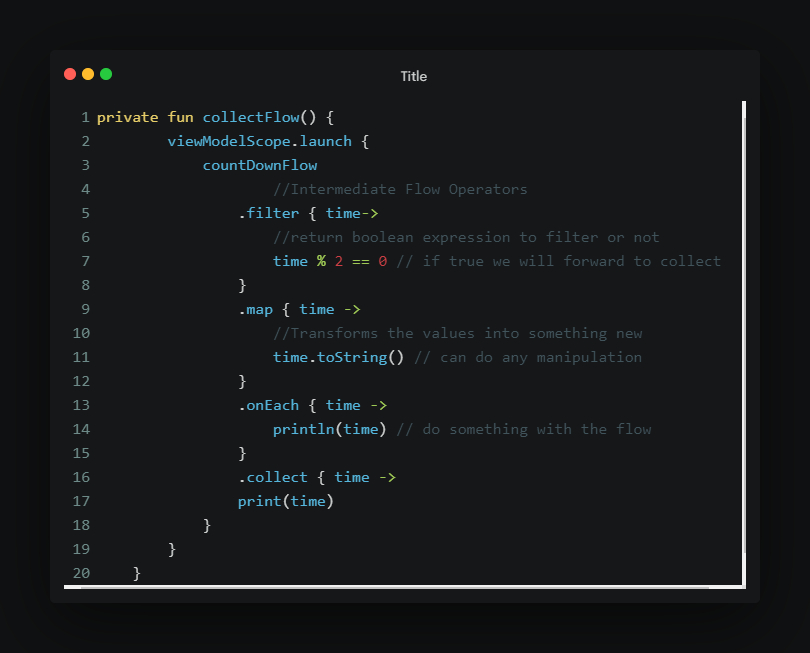
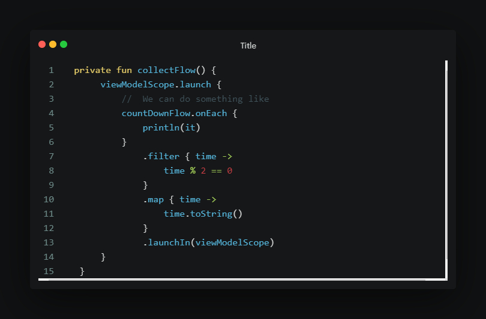

# Flow

- In coroutines, a flow is a type that can emit multiple values sequentially, as opposed to suspend functions that return only a single value.

- For example, you can use a flow to receive live updates from a database.

- Flows are built on top of coroutines and can provide multiple values. 

- The emitted values must be of the same type. For example, a Flow<Int> is a flow that emits integer values.

- A flow is very similar to an Iterator that produces a sequence of values, but it uses suspend functions to produce and consume values asynchronously. 

## 3 entities involved in streams of data:

### Producer

Produces data , and is added to stream, and flow uses coroutines to produce data asynchronously.

- In Android, a repository is typically a producer of UI data.

### Intermediaries

Modify each value emitted into the stream or the stream itself.

- Layers in between the producer and consumer usually act as intermediaries that modify the stream of data to adjust it to the requirements of the following layer.

### Consumer

Consumes the values from the stream.

- UI layer in android as consumer displays data.

## Creating a flow

- Created using flow builder APIs. 
- ```flow``` builder function creates a new flow where we can manually emit new values into stream using ```emit``` function.

## Flow example

### Example 1

```kotlin
class NewsRemoteDataSource(
    private val newsApi: NewsApi,
    private val refreshIntervalMs: Long = 5000
) {
    val latestNews: Flow<List<ArticleHeadline>> = flow {
        while(true) {
            val latestNews = newsApi.fetchLatestNews()
            emit(latestNews) // Emits the result of the request to the flow
            delay(refreshIntervalMs) // Suspends the coroutine for some time
        }
    }
}

// Interface that provides a way to make network requests with suspend functions
interface NewsApi {
    suspend fun fetchLatestNews(): List<ArticleHeadline>
}
```

> ViewModel Class


> Collecting the flow values should be done in viewmodel and not in UI



or



